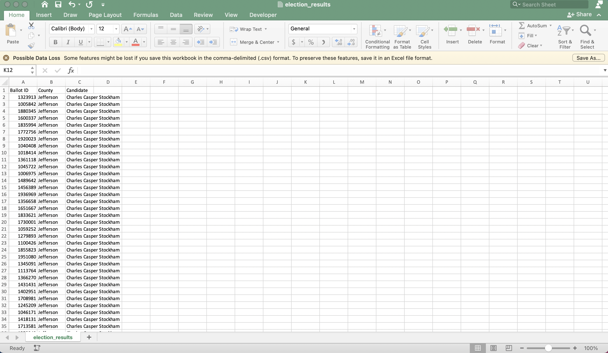
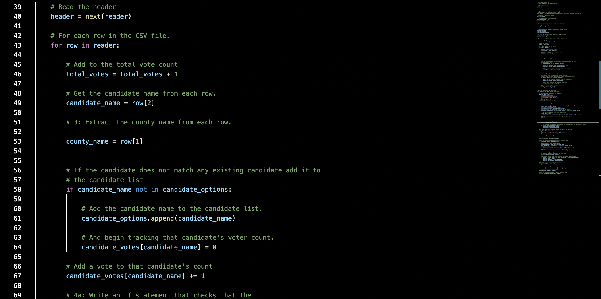

# Using A Python Interpreter to Analyze Election Results
The Vanderbilt University Data Analytics Bootcamp is a streamline of coursework that exposes students to a broad set of technical applications and data management concepts, strengthening their problem solving skills in data-driven contexts. Module 3 focuses on managing data in python files, python data structures, looping and conditional statements with python, printing, importing data, and mathematical operations that enable analysis.

This module culminated in a challenge tasking students with analyzing election results with a python interpreter that extracts data from a CSV file with election results.  Below is the written report detailing the scope and results of the election analysis.
## Overview of Election Audit
This audit of results of a tri-county election in Colorado, performed with a python interpreter to import election data in its raw from in a CSV file and analyze and print the election results in a new text file, provides clarity regarding election outcomes, including the candidates in the race, the number of votes for each candidate, the percentage of the vote for each candidate, and details of election turnout for each of the three counties implicated in the election.  All metrics in the audit results were generated from a raw data file, shown below, which lists the record number, candiate of choice, and county for each submission:

[Election Data CSV](Module3_Python/Election_Analysis/Resources/CSV_Screenshot.png)

## Election Audit Results

Total Votes: 369,711

### County Votes:
- Jefferson: 10.5% (38,855)
- Denver: 82.8% (306,055)
- Arapahoe: 6.7% (24,801)
- Largest County Turnout: _Denver_

### Candidate Outcomes:
- Charles Casper Stockham: 23.0% (85,213)
- Diana DeGette: 73.8% (272,892)
- Raymon Anthony Doane: 3.1% (11,606)

### Winner
- **Diana DeGette**
- Vote Count: 272,892
- Percentage: 73.8%

## Election Audit Summary

The code written in the python file can be used to perform analysis on elections with differing circumstances, such as more or fewer candidates.  The for loop that sifts through each row of the datasheet with raw election outcomes (shown below) appends any new candidates (noted by 'candidate_name') into the election candidates dictionary (candidate_options), adding each candiate one time and no more to prevent duplicates.  

[For Loop Appending Candidates](Module3_Python/Election_Analysis/Resources/ForLoop_CSVConversion.png)

The code would compile election data for any candidate indicated in the opened CSV file, indicating some flexibility for future use should elections have more or fewer than the three candidates in this example, or take place in more counties.  In addition, the script could easily be adapted to interpret a CSV file with a different structure, should the candidate name, submission number, and county location be organizated differently in the CSV housing the data.  Only the index reference given for the 'candidate_name' and 'county' name would need to be adapted so that the for loop would compile the name of the candidate and voter county for each submission correctly.  This gives analysts the flexibility to run this report even if the CSV have a different structure.
